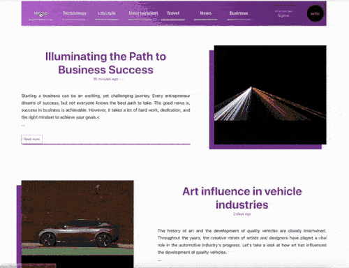
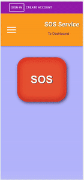
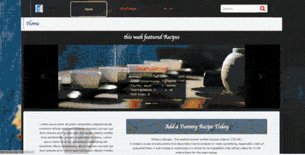
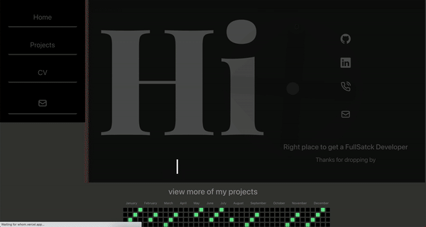
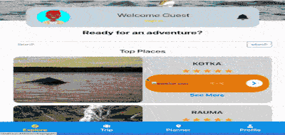
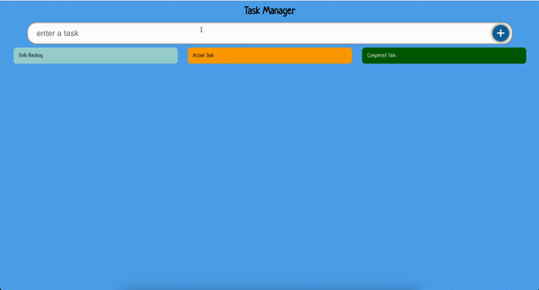

# Jesse Mwangi - System Developer

|  | [ LinkedIn ](https://www.linkedin.com/in/jesse-mwangi/) | [jessejzee@gmail.com](mailto:jessejzee@gmail.com) --- [tel:+1234567890](tel:+1234567890) |
| ---------------------------------- | ----------------------------------------------------- | ---------------------------------------------------------------------------------------- |

---

---

## Skills

| Back Ends      | Front End      | Database               | DevOps  | Version Control |
| -------------- | -------------- | ---------------------- | ------- | --------------- |
| C# / VB.NET    | JavaScript     | SQL Server / Postgress | CI / CD | GitHub          |
| Node Express   | Reacts / Redux |                        | Azure   | Bit Bucket      |
| ASP.NET / core | TypeScript     | No SQL                 | AWS     |

---

## Projects

<table bordercolor="#66b2b2">
  
  <tr>
    <td width="50%" height="150px" valign="top">
      <h3 align="left">Be Informed</h3>
        

---

   
    
  
      

        
Beinformed is a <strong> Fullstack (#express, #Amazon, #Postgress, #scss, #react) </strong> social media application that allows you to create an account, write updates, upload images, and publish your write-ups based on the category they belong to, such as Science, Technology, Arts, etc. Users are able to modify their own published write-ups. &#128521;

    </td>

 <td width="50%" height="200px" valign="top" align='center'>
      <h3 align="left">SOS</h3>
       

---

          
  
  
      

        
SOS is a mobile-first web application developed using Typescript and a Firebase Firestore backend. Its primary objective is to provide a quick and easy way to send a distress signal via SMS and email to a predefined list of contacts. The application is designed with simplicity in mind and optimized for use on mobile devices &#128295;

    </td>
  </tr>
  
  <tr>
    <td width="50%" height="150px" valign="top">
      <h3 align="left">Chef Guide</h3>
        

  
  

---

 

        
This full-stack <Strong>React </Strong> application was developed during my training at Business College Helsinki. The app allows users to enter ,review, rate favorite recipes and share them with others. The app is built using a <Strong>full-stack approach</strong>, with a backend server and database implemented using <Strong>Node.js and MongoDB</Strong> technologies. The frontend is built using <Strong>React and MUI</Strong>, allowing for a smooth and responsive user experience. Overall, this app demonstrates my full-stack developer ability to create a functional and user-friendly application. &#128640;

    </td>
    <td width="50%" height="150px" valign="top" style='overflow:hidden'>
      <h3 align="left">Who I am</h3>
        
         
        

          
  
  

  ---

        
Introducing my<Strong> full-stack developer </Strong> portfolio application, built with React and <Strong>Firebase Firestore database</Strong>, named "whom". This web application serves as a platform for showcasing my projects, experience, and skills. The user can easily navigate through my portfolio, view my CV, and even download it in PDF format. Additionally, the application offers an option to leave an email message, as well as links to my other professional profiles, such as LinkedIn and GitHub.

    </td>
  </tr>

  <tr>
    <td width="50%" height="150px" valign="top">
      <h3 align="left">City Trip Planner</h3>
        <a target="_blank" href="https://taste-it.vercel.app/">
          

---

 

  
  
      

        
This is a ReactJS-based application built with Firebase Firestore that allows you to plan your city trips. The app provides users with previews of cities, along with information about major tourist attractions to help you build your itinerary. It also includes Weather API data to provide up-to-date forecast information for your trip.. &#128640;

    </td>
    <td width="50%" height="150px" valign="top" style='overflow:hidden'>
      <h3 align="left">TS Todo Drag and Drop</h3>
        

---

          
  
  
      

        
This <strong> TypeScript-based </strong> Todo Application is a personal project that showcases the power of TypeScript and the usage of the <strong> drag and drop package </strong>. With this application, users can create, delete, mark as done, and modify their todos with ease. TypeScript helps minimize errors during development, making it an ideal language to use for building <strong> reliable and scalable </strong> applications.

    </td>
  </tr>

</table>

---

<h1 align="left">Technologies</h1>

    
    
    
    
    
    
    
    
    
    
    
    

## Github Stats

<h1 align="left">Connect</h1>

  
  
  

